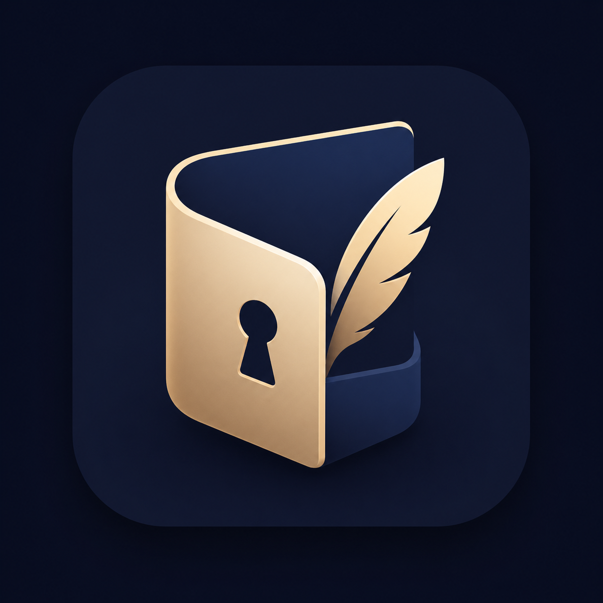

<p align="center">
  
</p>

# Secretary

A multi-platform secrets manager for passwords, API keys, secret notes, and similar credentials, designed for personal and family use without depending on any operated service.

> **Status: pre-alpha, Sub-project A feature-complete; hardening + audit next.** Architecture and cryptographic design are complete and frozen for v1. The Rust core now covers the full v1 vault surface: cryptographic primitives, identity, vault unlock, the block file format, the manifest layer with atomic I/O, and the high-level orchestrators (`create_vault`, `open_vault`, `save_block`, `share_block`). 340+ tests pass, including NIST KATs, vector-clock CRDT proptests, and a stdlib-only Python conformance script that does full hybrid-decap + AEAD-decrypt + hybrid-verify against the `golden_vault_001` fixture. What remains for Sub-project A is hardening + an external audit; FFI bindings and platform UIs come after that. There is no usable application yet. See [docs/](docs/) for the design and [ROADMAP.md](ROADMAP.md) for the phase plan.

---

## Why Secretary

Existing password managers fall into two camps: open-source-but-self-hosted (Bitwarden / Vaultwarden, KeePass), or polished-but-vendor-controlled (1Password, Dashlane, Apple Keychain). Most users need something simple to install, free of charge, with no ongoing service dependency, that supports family sharing including the inheritance case where children retain access to a deceased parent's credentials decades later.

That last requirement is the hard one. A vault that protects a credential for thirty or fifty years must defend against attacks that don't yet exist — most prominently, attacks by future quantum computers against the asymmetric primitives that protect data shared between users. Secretary therefore uses *post-quantum hybrid cryptography* from v1: every recipient-to-recipient key wrap and every signature combines a classical primitive with a NIST-standardized post-quantum primitive, so an attacker must break both to recover plaintext.

## Scope

Secretary is a client-only system. There is no server, no managed service, no hosted backend. Sync between devices uses any folder the user already has — iCloud Drive, Google Drive, Dropbox, OneDrive, a WebDAV mount on a home NAS, or a USB stick. Sharing between users uses any folder both parties can access.

**Target platforms (planned):**
- Desktop: macOS, Windows, Linux (Python with NiceGUI)
- Web: served by the same Python codebase (NiceGUI runs in a browser)
- iOS: native Swift / SwiftUI
- Android: native Kotlin / Jetpack Compose
- Browser autofill extensions: future

**Target users:**
- Individuals managing their own credentials
- Families sharing credentials selectively, including across generations (inheritance)
- Small teams, eventually

**Not in scope:**
- Server-mediated sync, real-time push notifications, server-side enforcement of policies
- Anonymity / metadata privacy from the user's chosen cloud-folder host
- Defense against compromise of the OS, hardware, or trusted computing base
- Coercion resistance / plausible deniability (may be added in a future format version)

## Architecture

```
                    ┌──────────────────────────────────────┐
                    │         secretary-core (Rust)        │
                    │                                      │
                    │   • Cryptographic primitives         │
                    │   • Vault format read/write          │
                    │   • Identity, recipients, sharing    │
                    │   • Conflict resolution (CRDT)       │
                    │   • Memory hygiene (zeroize, secret) │
                    └──────────────┬───────────────────────┘
                                   │
                ┌──────────────────┼──────────────────┐
                │                  │                  │
            PyO3 bindings     uniffi (Swift)    uniffi (Kotlin)
                │                  │                  │
                ▼                  ▼                  ▼
        ┌───────────────┐  ┌──────────────┐  ┌─────────────────┐
        │ Python +      │  │ Swift +      │  │ Kotlin +        │
        │ NiceGUI       │  │ SwiftUI      │  │ Jetpack Compose │
        │               │  │              │  │                 │
        │ Desktop + Web │  │ iOS          │  │ Android         │
        └───────────────┘  └──────────────┘  └─────────────────┘
```

The Rust core is the single source of truth for everything security-relevant — cryptography, vault parsing, key handling, conflict resolution. Each platform has its own native UI written in the language and idiom of that platform; UI is not shared across platforms (different platforms have different conventions, and Rust's GUI ecosystem is not yet mature enough to be the unifier).

**Why this architecture:** see [docs/adr/0001-rust-core.md](docs/adr/0001-rust-core.md). It mirrors the architecture used by Bitwarden, 1Password, Signal, and Mullvad — well-trodden territory.

## Cryptographic design at a glance

| Role | Primitive |
|---|---|
| Password KDF | Argon2id (m=256 MiB, t=3, p=1) |
| Symmetric AEAD | XChaCha20-Poly1305 (24-byte nonces, 256-bit keys) |
| KEM (recipient wraps) | X25519 ⊕ ML-KEM-768 hybrid |
| Signatures | Ed25519 ∧ ML-DSA-65 hybrid (both must verify) |
| Hash | BLAKE3 (general); SHA-256 (HKDF) |
| Recovery mnemonic | BIP-39, 24 words (256 bits) |

All hybrid constructions are designed so that an attacker must break *both* halves to compromise security. ML-KEM-768 (FIPS 203) and ML-DSA-65 (FIPS 204) are the NIST-standardized post-quantum primitives at security level 3.

For the full cryptographic specification — sufficient detail to implement an interoperable client from scratch — see [docs/crypto-design.md](docs/crypto-design.md). For the on-disk byte format, see [docs/vault-format.md](docs/vault-format.md). For threats addressed and explicitly not addressed, see [docs/threat-model.md](docs/threat-model.md).

## Vault structure (summary)

A vault is a directory of files:

```
<vault-folder>/
  vault.toml                # cleartext metadata (no secrets)
  identity.bundle.enc       # dual-wrapped identity (master KEK + recovery KEK)
  manifest.cbor.enc         # encrypted, signed top-level index
  contacts/                 # imported public contact cards
  blocks/                   # one file per block (encryption + sharing unit)
  trash/                    # tombstoned blocks awaiting purge
```

A *block* is the unit of both encryption and sharing. A block contains 1 or more records (login, secure note, API key, SSH key, custom). Sharing a block means copying its file into a folder the recipient can access, with the recipient's per-recipient key-wrap added to the file's recipient table.

## Documentation

| File | Purpose |
|---|---|
| [docs/glossary.md](docs/glossary.md) | Definitions of all terms used in the specs |
| [docs/threat-model.md](docs/threat-model.md) | Adversaries, attacks, defenses, explicit non-goals |
| [docs/crypto-design.md](docs/crypto-design.md) | Cryptographic constructions in spec-level detail |
| [docs/vault-format.md](docs/vault-format.md) | Byte-level on-disk format (v1) |
| [docs/adr/](docs/adr/) | Architecture decision records — six in total |

The docs are normative: a clean-room implementation in any language can be built from them alone, without reading the Rust source. This is verified during implementation by a Python conformance script that decrypts a published reference vault using only the spec.

## License

AGPL 3.0. A commercial license is available for entities wanting to ship closed-source derivatives. See [LICENSE](LICENSE).

The user-facing application and the source code are *both* free of charge. Only commercial closed-source derivatives require a paid license.

## Project status

Repository initialized April 2026. Sub-project A — the cryptographic foundation, vault format spec, and Rust core — is feature-complete; hardening and external audit are next:

| Component | Status |
|---|---|
| Cryptographic design + on-disk format spec (frozen for v1) | ✅ Complete |
| Cryptographic primitives (AEAD, KDF, KEM, sig, hash, identity) | ✅ Complete, NIST KAT-pinned |
| Vault unlock (BIP-39, identity bundle, vault.toml, recovery key) | ✅ Complete (PR #1) |
| Block file format (record CBOR, header, recipients, AEAD, hybrid sig) | ✅ Complete (PR #3) |
| Manifest layer + atomic writes + high-level orchestrators | ✅ Complete (PR #5) |
| `golden_vault_001/` end-to-end §15 conformance fixture (full crypto) | ✅ Complete (PR #5) |
| Hardening: fuzz, side-channel review, memory hygiene audit | 🚧 Next (Phase A.6) |
| External cryptographic audit | 🚧 Next (Phase A.6) |
| FFI bindings (PyO3, uniffi for Swift/Kotlin) | ⏳ Sub-project B |
| Platform UIs (NiceGUI desktop/web, SwiftUI iOS, Compose Android) | ⏳ Sub-project C |

340+ tests pass under `cargo test --release --workspace`; clippy clean with `-D warnings`; `#![forbid(unsafe_code)]` crate-wide. The repository tracks every cryptographic decision in `docs/adr/` and pins every primitive against published KATs (NIST FIPS 203 / FIPS 204, RFC 8032 / 7748, RFC 5869, RFC 9106, BIP-39 Trezor canonical vectors).

A clean-room implementation in any language can be built from `docs/` alone. This is verified by [core/tests/python/conformance.py](core/tests/python/conformance.py) — a stdlib-only `uv run`-compatible Python script that parses the §15 block KAT directly from spec constants and performs full hybrid-decap + AEAD-decrypt + hybrid-verify against the `golden_vault_001/` reference vault, with no dependencies on the Rust source.

The project is intentionally being built slowly and carefully. Cryptographic systems that handle multi-decade-lifetime secrets are not the right place to optimize for time-to-MVP. See [ROADMAP.md](ROADMAP.md) for the phased plan.

## Contact

This is a personal project by [Horst Herb](https://github.com/hherb). Issues and pull requests on this repository are welcome once the foundation is in place — see the project status above.
